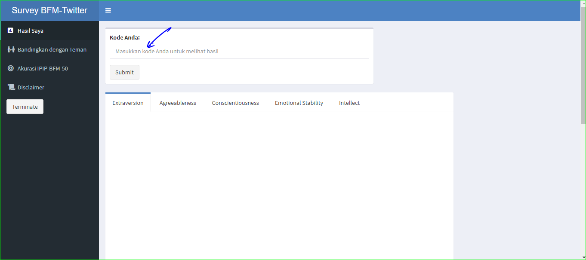

```{r setup, include=FALSE}
knitr::opts_chunk$set(echo = F)
```


## Survey

Survey ini adalah bagian dari penelitian skripsi penulis yang berjudul **Validitas Prediktif Data Twitter sebagai Prediktor Kepribadian Big-Five**.

### Kepribadian dan Twitter

Dewasa ini, kepribadian mulai dapat diprediksi oleh Twitter. Salah satu penelitian mengenai hal ini dilakukan oleh Kosinski (2013). Dalam penelitian tersebut, data likes facebook dapat digunakan untuk memprediksi usia, status merokok, agama, dan beberapa trait lainnya.

### Tujuan Penelitian

Fenomena tersebut menarik untuk diteliti, terutama mengenai "seberapa akurat prediksi tersebut?". Selain ketertarikan pada kemampuan model statistik yang menggunakan data Twitter untuk memprediksi kepribadian, peneliti -yang juga terinspirasi dari Kosinski- berharap bahwa dengan melakukan penelitian ini, penulis dapat membangun kesadaran netijen (user) bahwa jejak digital kita dapat digunakan untuk memprediksi kepribadian kita. Segala aktifitas yang kita lakukan di sosial media, dapat memberikan informasi mengenai diri kita.

---

## Hasil


### Akurasi

Akurasi, dalam psikologi biasa dikenal dengan istilah validitas dan reliabilitas alat tes. Survey ini didasarkan pada kuesioner [IPIP-BFM-40](https://projects.ori.org/lrg/PDFs_papers/Goldberg.Big-Five-Markers-Psych.Assess.1992.pdf) yang dikembangkan oleh Goldberg. Diketahui bahwa kuesioner tersebut memiliki akurasi yang baik. 

Hanif Akhtar dan Saifuddin Azwar (2019), melakukan [adaptasi bahasa dan budaya Indonesia dari kuesioner IPIP-BFM-50](https://jurnal.ugm.ac.id/jpsi/article/download/33571/24215). Dalam penelitian ini juga diterangkan bahwa akurasinya terbilang baik.

Namun jangan berharap bahwa hasil yang ditunjukkan pada penelitian Saya adalah hasil yang 100% akurat. Penelitian ini memang tidak selengkap tes psikologi berbayar yang menyajikan data secara komprehensif. Salah satu alasannya adalah desain penelitian yang lebih fokus pada korelasi hasil kuesioner dengan prediksi kepribadian oleh data Twitter pengetahuan. Alasan lainnya karena kapasitas kemampuan dan pengetahuan penulis yang masih dalam tahap belajar. Walau demikian, Saya berusaha sebaik mungkin menjaga kaidah ilmiah dalam penelitian ini

### Cara cek hasil

Berikut ini cara melihat hasil skor Anda:

1. Buka aplikasi penampil hasil kuesioner ini [di sini](https://isaid-hi.shinyapps.io/hasil-kuesioner-ipipbfm50/?_ga=2.71727125.769089319.1610991942-154121231.1610991942)


2. Setelah masuk ke aplikasi, silakan masukkan kode unik anda



3. Klik submit


4. Setelah selesai melihat hasil, klik terminate untuk menutup aplikasi


---


## Perlu diingat!


### Keterbatasan waktu

Aplikasi penampil hasil kuesioner yang saya buat adalah versi gratis sehingga pemakaiannya dikenakan batas waktu. Maka dari itu, mohon bijaksana dalam menggunakannya, serta mohon untuk menutup aplikasi dengan klik "Terminate" atau tutup browser setelah selesai melihat hasil.

### Data tidak lengkap

Bisa jadi kode yang Anda masukkan sudah benar, namun aplikasi membacanya sebagai error. Bila demikian silakan hubungi Saya melalui [email](nursyahid.zanky@gmail.com)